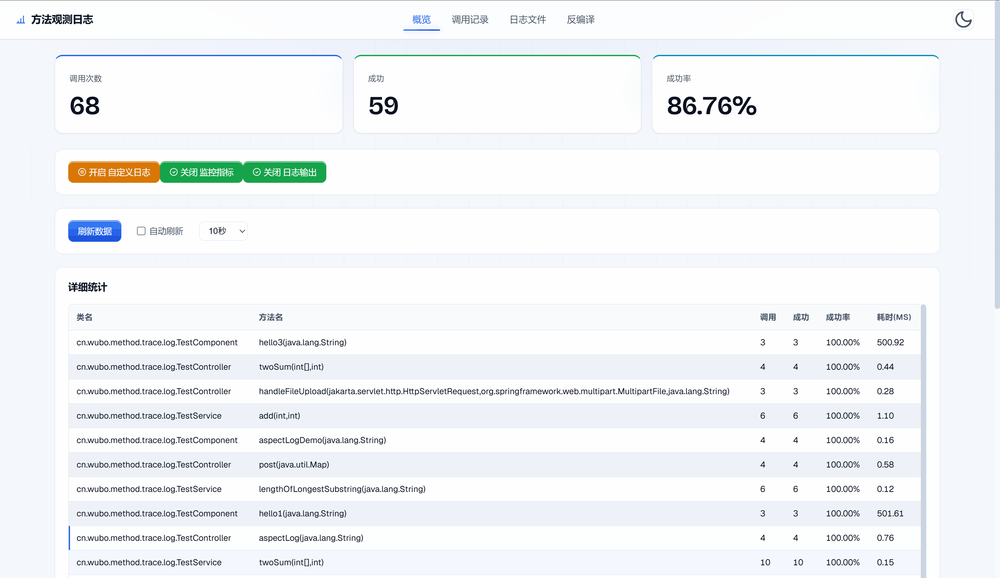

# Method Trace Log

<div align="right">
  English | <a href="README.zh-CN.md">中文</a>
</div>

> Spring Boot starter for method tracing, performance monitoring, log file management, and CFR-backed decompilation. Includes a standalone MCP server (`methodTraceLog-mcp`) that exposes the same capabilities to AI agents over stdio.

[](https://jitpack.io/#com.gitee.wb04307201/methodTraceLog)
[](https://gitee.com/wb04307201/methodTraceLog)
[](https://gitee.com/wb04307201/methodTraceLog)
[](https://github.com/wb04307201/methodTraceLog)
[](https://github.com/wb04307201/methodTraceLog)
  



---

## Features

| | |
|---|---|
| **Method tracing** | AOP-based, full call chain with `traceid` / `spanid` / `pspanid`; sampling; `@AspectLog` to override the display name |
| **Metrics** | Micrometer `Timer` per method + parent/child `MethodTraceInfo` tree; exposed via `actuator/methodtrace` |
| **Log file viewer** | Read / filter / download log files; WebSocket live tail; path-traversal safe |
| **CFR decompile** | HTTP endpoint for any class on the classpath (app / 3rd-party / fat-jar nested), annotations stripped |
| **OTel export** | Auto-bridges trace events to OpenTelemetry OTLP/HTTP when `opentelemetry-sdk` is on the classpath |
| **W3C traceparent** | Auto-injects / extracts `traceparent` header for HTTP inbound and `RestClient` outbound |
| **Cookie session** | Browser login via `POST /methodTraceLog/login`, HTTP `X-Api-Key` for CLI / MCP |
| **MCP server** | Standalone stdio process; 15 tools, multi-host, forwards to your starter over HTTP |

---

## Quick Start

### Add the dependency

```xml
<dependency>
    <groupId>io.github.wb04307201</groupId>
    <artifactId>methodTraceLog-spring-boot-starter</artifactId>
    <version>1.0.20</version>
</dependency>
```

### Minimal configuration

```yaml
method-trace-log:
  log:
    enable: true
  file:
    enable: true
    path: ./logs
  security:
    api-key: change-me-in-production   # required in production; empty disables auth (dev only)

management:
  endpoints:
    web:
      exposure:
        include: methodtrace           # for the /actuator/methodtrace panel data
```

### Open the panel

`http://localhost:8080/methodTraceLog/panel` — single page with 4 tabs: 概览 (overview) / 调用记录 (trace search + export) / 日志文件 (file viewer + real-time tail) / 反编译 (CFR decompile).

---

## Configuration Reference

```yaml
method-trace-log:
  log:
    enable: true                                  # AOP master switch
    sample-rate: 1.0                              # 0.0 ~ 1.0; child spans inherit parent decision (clamped on startup)
    exclude-patterns: []                          # method-name blacklist (case-insensitive equals match); hit → proceed() directly, no events emitted. e.g. [equals, hashCode, toString, canEqual]
    service-calls:                                # start-up enable flags
      - { name: CustomLog,         enable: false }   # built-in services: SimpleLogService / SimpleMonitorService / AlertingService / CustomLog
    trace-store:                                  # where the in-memory tree lives
      type: in-memory                             # in-memory | file | none
      path: ./trace-store                         # only when type=file (auto-creates yyyy-MM-dd subdirs)
      max-traces: 1000                            # recent map cap (in-memory & file memory cache)
      ttl-millis: 28800000                        # 8h; clean() drops disk files older than this
      rebuild-index-on-start: false               # type=file only; rebuilds traceId→file index at startup (slows boot on large dirs)
  file:
    enable: true
    path: ./logs
    allowed-extensions: [.log, .txt, .out]
    scan-lines: 10000                             # stream-scan line cap; Files.lines() + limit() is lazy, so the file itself can be arbitrarily large — no size check
    max-file-size: 100MB                          # per-file size cap (default; set to 0/null = no limit)
    total-size-cap: 10GB                          # cumulative cap across all rolled files in the dir
    # log-pattern: (\d{4}-\d{2}-\d{2} \d{2}:\d{2}:\d{2}\.\d{3})\s+\[([^\]]+)\]\s+(\w+)\s+([^\s]+)\s*-\s*(.*)
  security:
    api-key: change-me-in-production              # empty = no auth
    session:
      ttl-millis: 28800000                        # 8h sliding session for browser cookies
    cors:                                         # CORS for browser panels on different origins (opt-in: empty allowed-origins = disabled)
      allowed-origins: []                         # ["https://your-panel.example.com"]; ["*"] = all (incompatible with credentials)
      allowed-methods: [GET, POST, OPTIONS, DELETE, PUT]
      allowed-headers: [Content-Type, X-Api-Key, Authorization]
      allow-credentials: false                    # true requires allowed-origins NOT be "*"
      max-age: 0                                  # preflight cache seconds (0 = always re-validate)
  decompile:
    timeout-seconds: 10                           # CFR daemon-thread timeout
  otel:                                           # requires opentelemetry-sdk on classpath
    enable: false
    endpoint: http://localhost:4318/v1/traces
    service-name: method-trace-log
    service-namespace: ""                        # Resource service.namespace label
    export-delay-millis: 5000                    # OTLP client built-in batching delay
    max-queue-size: 2048
    max-export-batch-size: 512
    export-timeout-millis: 30000
  propagate:                                      # W3C traceparent propagation
    http-inbound: true                            # TraceContextFilter reads traceparent
    rest-client-outbound: true                    # RestClient.Builder interceptor
    rest-template-interceptor: true               # exposes a RestTemplate interceptor bean
  alerting:                                       # exception alerting — opt-in; off by default
    enable: false                                 # true registers AlertingService as an ICallService
    webhook-url: ""                               # empty = log only; non-empty POSTs events (best-effort, async)
    threshold:
      error-count: 10                             # errors per class#method within window to fire
      window-seconds: 60                          # sliding-window length
    cooldown-seconds: 300                         # suppress repeat alerts for the same key
    classes: []                                   # whitelist prefix list; empty = alert on every class
```

### What's new

Highlights from Rounds 7–18 (12 rounds, ~38 commits) since the last doc sync — see `TEST_REPORT.md` §Round 7 onward for the full record.

- **Coverage** (Round 7) — 14 integration test classes (`TracePropagationIT`, `OtelPropagationIT`, `AlertingIT`, `SlowMethodIT`, `SamplingIT`, `ExcludePatternIT`, `TraceStoreIT`, `LogFileQueryIT`, `LogFileMonitorIT`, `DecompileIT`, `SessionAuthIT`, `CorsIT`, `PanelIT`, `McpIntegrationIT`) cover every feature end-to-end via dual-path verification (JUnit HTTP + Agent MCP). 26 e2e + 11 deep-coverage test methods = 37 new tests in `cn.wubo.method.trace.log.e2e.*`. Round 11 added 7 more IT classes for deep paths (5+ level nested calls, concurrent trace isolation, MDC cleanup, cooldown suppression, sample-rate exclusion, in-memory OTel export, file-store persistence). Two real bugs were caught and fixed during Round 7 itself: `CorsFilterConfig` had been silently missing from `AutoConfiguration.imports` since Round 5 (CORS had been broken in production); `exclude-patterns` existed in code but was never put into the test app's YAML.

- **Cross-instance `pspanid` fix** (Rounds 8–9) — coordinated two-file change that resolves the MDC key mismatch caught in Round 7 (Ruling 6). `LogAspect` now sets `pspanid = prespanid != null ? prespanid : prepspanid`: in-process nested calls use the calling span's id; cross-instance inbound calls use the upstream parent's span id from the W3C `traceparent` header. `SimpleMonitorServiceImpl.save()` switched its condition from `pspanid == null` to `methodTraceInfoMap.get(pspanid) == null` (null-safe) — true roots and cross-instance inbounds both get saved as top-level entries; in-process children attach only.

- **OTel test environment** (Round 10) — `OtelPropagationIT` body now actually executes end-to-end. The test harness boots the primary context with `method-trace-log.otel.enable=true` and injects the SDK bean into `GlobalOpenTelemetry`, so `Span.current().getSpanContext().isValid()` returns true and the cross-JVM traceid assertion makes sense. `GlobalOpenTelemetry.resetForTest()` cleans up in `@AfterAll`. Was 1 skipped → 0 skipped.

- **Risk-driven testing** (Rounds 12, 16–17) — 92 risks from the 2026-08-29 risk inventory systematically closed: 14 new test classes / 53 new methods in Round 12 (top risks), 8 classes / 74 methods in Round 16 (medium), 13 classes / 97 methods in Round 17 (low). Coverage spans boundaries, properties, concurrency races, eviction races, lifecycle / shutdown paths, resource leaks, and edge cases. Dead code `cn.wubo.method.trace.log.sampler.SampledDecision` deleted (Round 17 R-66, grep confirmed zero production usage).

- **`/code-review` fixes** (Round 13) — 9 real bugs fixed from the code-review run:
  - `CorsFilterConfig` was registered against `/*` instead of `/methodTraceLog/*` — silently shadowed user-defined filters for other URL patterns.
  - `ErrorMessagePropertiesPostProcessor` used `addFirst` on the `PropertySources` list, overriding user values from `application.yml` / command line — switched to `addLast` so starter defaults take lowest priority.
  - `AlertingService` cooldown check-then-put was non-atomic → concurrent duplicates fired webhooks. Now uses `putIfAbsent(key, now)`.
  - `DecompilerUtils.extractMethod` regex did not match constructors (no return-type group); constructors now match.
  - `/methodTraceLog/decompile` returned 404 when the method could not be extracted (e.g. constructors) instead of the documented full-class-source fallback — restored the contract; external consumers expecting 404 must adapt.
  - `SimpleMonitorServiceImpl` cross-thread race caused duplicate root insertion when the parent's `BEFORE` arrived after a child's `BEFORE`; now skips save when the parent already has in-flight children.
  - `sample-rate` clamp threw on YAML `NaN`/`Infinity`; `Double.isFinite(rate) ? clamp : 1.0` is the fix.
  - Log path env-post-processor silently succeeded when the directory was non-writable; now probe `Files.isWritable` and throw `IllegalArgumentException` (honors documented fail-fast).
  - `AlertingService` was discarding the raw `Throwable` via `transContext(info.getContext())`; switched to `info.getRawException()` to preserve the original exception + stack trace.

- **MCP module hardening** (Rounds 14–15) — 18 fixes from the MCP risk inventory. Highlights:
  - **HTTP timeouts**: 3s connect, 30s read for normal calls / 120s for long-polling. Implemented via `JdkClientHttpRequestFactory` + switched to Apache HttpClient 5 backed by `@Bean(destroyMethod="close") CloseableHttpClient` so the connection pool is released on context shutdown (`spring.lifecycle.timeout-per-shutdown-phase=30s`).
  - **16 MiB response size cap** via `SizeLimitingClientHttpRequestFactory` (delegating factory with `Content-Length` pre-check + streaming `BoundedInputStream` byte counter — `ExchangeStrategies.maxInMemorySize` doesn't exist on `RestClient.Builder` in Spring 6.2).
  - **Retry with exponential backoff** for idempotent GETs (2 retries, 100–500ms) via a `ToolOp` enum + `doWithRetry`.
  - **Structured error JSON** via `safeGet`/`safePost` + `toErrorJson` + cause-chain walker — never leaks stack traces.
  - **Multi-host config validation** in `@PostConstruct validateHosts()` rejects empty `hosts[]` / duplicate names / blank fields / non-http(s) URLs; cleartext `http://` + non-empty `api-key` emits a WARN.
  - **`ping` resilience**: tries `/actuator/health` first, falls back to `/methodTraceLog/view/callServices`, returns `HOST_NOT_EXPOSING_ACTUATOR` envelope if both 404.
  - **URL encoding fix**: `URLEncoder.encode(s, UTF_8).replace("+", "%20")` for RFC 3986 path encoding.
  - **Argument validation**: `getMethodTraceByTraceId` validates `^[A-Za-z0-9_-]{1,128}$`; `validateLogQueryArgs` clamps `fileName ≤ 256`, `keyword ≤ 1024`, validates ISO 8601 `startTime`/`endTime`.
  - **Structured audit logging** via `mcp.audit` SLF4J logger; `doWithRetry` emits one `tool= host= path= status= duration=ms` line per call (routed to `System.err` by `logback-spring.xml` so JSON-RPC over stdout stays clean).
  - **+71 MCP tests** across both rounds (13 → 46 → 84).

- **Performance** (Round 18) — `LogFileService.queryLogs` moved its `page<1` runtime guard to the top of the method, before any `Files.lines().limit(maxScanLines)` read+filter. Added a parallel `pageSize<1` guard. Invalid input now fails fast without paying the file-IO cost; the original post-read page guard is retained as belt-and-braces.

**Test totals after Round 18**: **565 tests** across both modules (475 main module + 90 MCP module), all green, 0 skipped.


---

## HTTP Surface

All routes require `X-Api-Key` (or `MTRACE_SESSION` cookie) when `security.api-key` is non-empty, **except** `/methodTraceLog/panel` (HTML).

| Method | Path | Purpose |
|---|---|---|
| GET | `/methodTraceLog/panel` | HTML panel — 4 tabs (whitelisted) |
| GET | `/methodTraceLog/view/callServices` | List services + enable state |
| GET | `/methodTraceLog/view/callService?name=&enable=` | Toggle a service at runtime |
| GET | `/methodTraceLog/view/list?className=&methodName=&onlyErrors=&limit=` | Recent root traces |
| GET | `/methodTraceLog/view/traceid?id=` | Full call chain for a trace id |
| GET | `/methodTraceLog/view/export?format=json\|csv&className=&methodName=&onlyErrors=&limit=` | Bulk export (default limit 1000) |
| GET | `/methodTraceLog/view/alerts?limit=` | Recent alert events (default limit 50; empty list when alerting disabled) |
| GET | `/methodTraceLog/view/slowMethods?windowMinutes=&topN=` | Slowest methods top-N from Micrometer histograms (default 5min / top 10) |
| GET | `/methodTraceLog/decompile?className=&methodName=&timeoutSeconds=` | Text/plain source |
| GET | `/methodTraceLog/logFile/files` | List log files in the configured dir |
| POST | `/methodTraceLog/logFile/query` | Filter / paginate / time-range / level |
| POST | `/methodTraceLog/logFile/download` | Stream the same content as text |
| GET | `/methodTraceLog/logFile/monitor/{start,stop,status}?fileName=` | REST live-tail (companion to STOMP) |
| POST | `/methodTraceLog/login` | Body `{"apiKey":"..."}` → `Set-Cookie: MTRACE_SESSION=...` |
| POST | `/methodTraceLog/logout` | Invalidate session |
| GET | `/methodTraceLog/session/status` | `{ sessionValid: true/false }` |
| WS | `/ws` (SockJS) → `/topic/log-monitor` | Live log lines; STOMP send to `/app/{start-monitor,stop-monitor,monitor-status,heartbeat}` |
| GET | `/actuator/methodtrace` | Per-class / per-method Micrometer stats |

---

## MDC Trace IDs

`LogAspect` puts `traceid` / `spanid` / `pspanid` into SLF4J MDC. Use them in your logback pattern to correlate logs across the call chain:

```xml
<pattern>%d{HH:mm:ss.SSS} [%thread] [trace=%X{traceid} span=%X{spanid}] %-5level %logger - %msg%n</pattern>
```

For HTTP boundaries, `TraceContextFilter` reads `traceparent` on the way in, and the `RestClient` interceptor writes it on the way out — upstream and downstream `traceid`s join automatically.

---

## Web Panel Authentication

When `security.api-key` is non-empty, the panel UI uses a top **banner** (not a modal) to collect the API Key:

- Banner is shown above the tab content the first time you visit `/methodTraceLog/panel` without a valid session.
- Submitting a valid Key (button or **Enter**) hides the banner, sets the `MTRACE_SESSION` cookie, and **auto-loads the current tab's data** — no manual refresh.
- Wrong / empty Key shows an inline error (`请输入 API Key` / `❌ API Key 无效或鉴权未启用`).
- Session is a **sliding 8-hour cookie** (`security.session.ttl-millis`, default 28 800 000). It renews on use, so you only re-enter the Key after 8h of inactivity or after clicking the **🚪 注销** button.
- The logout button only appears in the header when a session is active; the `/methodTraceLog/logout` endpoint invalidates the cookie and re-mounts the banner.
- In dev mode (`api-key: ""`), the banner is suppressed entirely and no logout button is shown.

`GET /methodTraceLog/session/status` returns `{ authEnabled, sessionValid }` so the panel JS can decide whether to show the banner. While the banner is up, the in-page `mtlFetch` queues 401 responses and replays them on successful login, so the user never sees an "unauthorized" toast during the login flow.

CLI / MCP clients should keep using the `X-Api-Key` header directly — the cookie session is purely a browser convenience.

---

## `@AspectLog` Annotation

Method-level opt-in (the class doesn't have to be a `@Component`). Use it to rename the method in the trace tree and on the OTel span:

```java
public class MyHelper {
    @AspectLog("do-something")
    public void doSomething(String s) { ... }
}
```

The trace list and OTel span name will show `do-something` instead of the raw method signature.

---

## Custom `ICallService`

Extend `AbstractCallService` and implement `consumer(ServiceCallInfo)`. It's auto-picked up by the `CallServiceStrategy`:

```java
@Component
public class MyService extends AbstractCallService {

    @Override
    public void consumer(ServiceCallInfo info) {
        // logActionEnum is one of BEFORE / AFTER_RETURN / AFTER_THROW
        log.info("{} {}", info.getClassName(), info.getMethodName());
    }

    @Override public String getCallServiceName() { return "MyService"; }
    @Override public String getCallServiceDesc() { return "My desc"; }
}
```

Start it disabled: `service-calls: [{ name: MyService, enable: false }]`, then flip via the panel.

---

## MCP Server

A separate, standalone Spring Boot process that speaks Model Context Protocol over stdio. It forwards `@Tool` calls to one or more hosts (each host = an app that has the starter on the classpath) over HTTP.

MCP server config (`mcpServers` JSON block) for AI clients like Claude Desktop, Cursor, Cline:

```json
{
  "mcpServers": {
    "sql-forge-mcp": {
      "command": "jbang.cmd",
      "args": [
        "io.github.wb04307201:methodTraceLog-mcp:1.0.20",
        "--method-trace-log.mcp.hosts[0].name=local-dev",
        "--method-trace-log.mcp.hosts[0].url=http://localhost:8080",
        "--method-trace-log.mcp.hosts[0].description=Local dev",
        "--method-trace-log.mcp.hosts[0].api-key=change-me-in-production"
      ]
    }
  }
}
```

**15 tools exposed:** `getHosts`, `ping`, `getCallServices`, `setCallServiceEnable`, `getMethodTraceList`, `getMethodTraceByTraceId`, `getAlerts`, `getSlowMethods`, `decompileMethod`, `getLogFiles`, `queryLogContent`, `downloadLog`, `startMonitor`, `stopMonitor`, `getMonitorStatus`.

---

## Gotchas

- **`LogAspect` exclusions:** framework-internal types (`ICallService`, `MethodTraceLogEndPoint`, `LogFileService`, `LogFileRealTimeService`) are excluded. Add yours to the pointcut if you have similar internal beans.
- **Path traversal:** `FileUtils.pathInspection` is the whitelist for `LogFileService` and `LogFileRealTimeService` — `[a-zA-Z0-9._-]+`, no `..`, ≤ 255 chars.
- **Log pattern:** the default `log-pattern` only matches the standard logback pattern. If you change `<pattern>` in `logback.xml`, update `log-pattern` in YAML or `LogLineInfo.parse` will not split keyword / level / time.
- **CFR resources:** decompile reads class bytes through the classloader's `getResourceAsStream` — works uniformly for file paths, thin jars, and Spring Boot fat-jar nested jars. Don't parse the `URL.getPath()` string.
- **Spring Boot fat-jar:** the test module does not declare `spring-boot-maven-plugin`. Use `mvn package` then `java -cp target/classes;<classpath> cn.wubo.method.trace.log.MethodTraceLogTestApplication`.
- **Maven on this machine:** invoke `mvn` as `/c/developer/apache-maven-3.9.16/bin/mvn` — the default `mvn` shim is broken.
