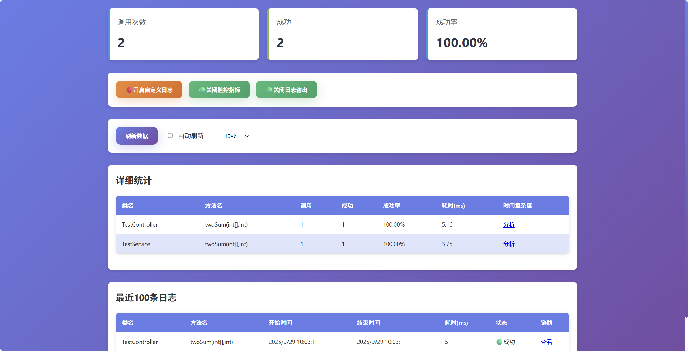

# Method Trace Log

<div align="right">
  English | <a href="README.zh-CN.md">中文</a>
</div>

> A starter component for method tracing logs, providing method call chain tracking, performance monitoring, log file management, and (optional) AI time complexity analysis.

[](https://jitpack.io/#com.gitee.wb04307201/methodTraceLog)
[](https://gitee.com/wb04307201/methodTraceLog)
[](https://gitee.com/wb04307201/methodTraceLog)
[](https://github.com/wb04307201/methodTraceLog)
[](https://github.com/wb04307201/methodTraceLog)  
  

---


## Features

### Method Tracing
- Automatic recording of method call chains
- Support for method execution time statistics
- Visual display of call relationships and time consumption
- Support for exception capture and recording

### Log File Management
- Real-time viewing of log file contents
- Support for log file download
- Log content search and filtering
- WebSocket real-time log push

### AI Code Analysis (Optional)
- Time complexity analysis
- Performance optimization suggestions
- Code quality assessment
- Visual analysis result display

---

## Getting Started

### Add JitPack Repository
```xml
<repositories>
    <repository>
        <id>jitpack.io</id>
        <url>https://jitpack.io</url>
    </repository>
</repositories>
```

### Maven Dependency
```xml
<dependency>
    <groupId>com.gitee.wb04307201.methodTraceLog</groupId>
    <artifactId>methodTraceLog-spring-boot-starter</artifactId>
    <version>1.0.16</version>
</dependency>
```

### Configuration
Add configuration:
```yaml
method-trace-log:
  log:
    enable: true          # Whether to enable method tracing, default is true
    serviceCalls:        # Log services enabled at startup, by default all are enabled without configuration. In production environments, all can be configured to be disabled and enabled through the web interface when needed
      - name: SimpleLogService  # Log output service
        enable: false
      - name: SimpleMonitorService  # Metrics monitoring service
        enable: false
  file:
    enable: true          # Whether to enable file-related functions, default is true
    path: ./logs          # Log file path
    allowed-extensions:   # Allowed file extensions
      - .log
      - .txt
      - .out
    max-lines: 1000       # Maximum lines per query
    max-file-size: 100    # Maximum file size (MB)
    # Log file matching pattern,
    # Default: (\d{4}-\d{2}-\d{2} \d{2}:\d{2}:\d{2}\.\d{3})\s+\[([^\]]+)\]\s+(\w+)\s+([^\s]+)\s*-\s*(.*)
    # Matches %d{yyyy-MM-dd HH:mm:ss.SSS} [%thread] %-5level %logger{36} - %msg%n log output format
    log-pattern: (\d{4}-\d{2}-\d{2} \d{2}:\d{2}:\d{2}\.\d{3})\s+\[([^\]]+)\]\s+(\w+)\s+([^\s]+)\s*-\s*(.*)
management:
  endpoints:
    web:
      exposure:
        include: methodtrace # Enable custom endpoint
```

### AI Analysis Configuration (Optional)

To use the AI code analysis feature, you need to introduce and configure Spring AI. The following example shows how to call qwen3 through ollama:
```xml
<dependencyManagement>
    <dependencies>
        <dependency>
            <groupId>org.springframework.ai</groupId>
            <artifactId>spring-ai-bom</artifactId>
            <version>1.0.2</version>
            <type>pom</type>
            <scope>import</scope>
        </dependency>
    </dependencies>
</dependencyManagement>
<dependencies>
    <dependency>
        <groupId>org.springframework.ai</groupId>
        <artifactId>spring-ai-starter-model-ollama</artifactId>
    </dependency>
</dependencies>
```

```yaml
spring:
  ai:
    ollama:
      chat:
        options:
          model: qwen3    # Model used
      base-url: http://localhost:11434
```

## Usage

### Default method log output:
```
2025-08-18T10:59:45.638+08:00  INFO 17236 --- [           main] c.w.m.t.l.s.impl.DefaultLogServiceImpl   : traceid: 734415a6-6059-42c9-95ee-399dd4877aab, pspanid: null, spanid: a52a7934-88d3-44e9-bcf5-1469a0364493, classname: cn.wubo.method.trace.log.TestController, methodSignature: public java.lang.String cn.wubo.method.trace.log.TestController.get(java.lang.String), context: [java], logActionEnum: LogActionEnum.BEFORE(desc=方法执行前), time: 1755485985638
2025-08-18T10:59:45.644+08:00  INFO 17236 --- [           main] c.w.m.t.l.s.impl.DefaultLogServiceImpl   : traceid: 734415a6-6059-42c9-95ee-399dd4877aab, pspanid: a52a7934-88d3-44e9-bcf5-1469a0364493, spanid: e9526f48-e423-4112-a9e2-8b3843c0d15a, classname: cn.wubo.method.trace.log.TestService, methodSignature: public java.lang.String cn.wubo.method.trace.log.TestService.hello(java.lang.String), context: [java], logActionEnum: LogActionEnum.BEFORE(desc=方法执行前), time: 1755485985644
2025-08-18T10:59:45.647+08:00  INFO 17236 --- [           main] c.w.m.t.l.s.impl.DefaultLogServiceImpl   : traceid: 734415a6-6059-42c9-95ee-399dd4877aab, pspanid: e9526f48-e423-4112-a9e2-8b3843c0d15a, spanid: 4c1ba448-612b-463a-8f75-a3eb6262e37f, classname: cn.wubo.method.trace.log.TestComponent, methodSignature: public java.lang.String cn.wubo.method.trace.log.TestComponent.hello(java.lang.String), context: [java], logActionEnum: LogActionEnum.BEFORE(desc=方法执行前), time: 1755485985647
2025-08-18T10:59:45.647+08:00  INFO 17236 --- [           main] c.w.m.t.l.s.impl.DefaultLogServiceImpl   : traceid: 734415a6-6059-42c9-95ee-399dd4877aab, pspanid: e9526f48-e423-4112-a9e2-8b3843c0d15a, spanid: 4c1ba448-612b-463a-8f75-a3eb6262e37f, classname: cn.wubo.method.trace.log.TestComponent, methodSignature: public java.lang.String cn.wubo.method.trace.log.TestComponent.hello(java.lang.String), context: JAVA say:'hello world!', logActionEnum: LogActionEnum.AFTER_RETURN(desc=方法执行后), time: 1755485985647
2025-08-18T10:59:45.648+08:00  INFO 17236 --- [           main] c.w.m.t.l.s.impl.DefaultLogServiceImpl   : traceid: 734415a6-6059-42c9-95ee-399dd4877aab, pspanid: a52a7934-88d3-44e9-bcf5-1469a0364493, spanid: e9526f48-e423-4112-a9e2-8b3843c0d15a, classname: cn.wubo.method.trace.log.TestService, methodSignature: public java.lang.String cn.wubo.method.trace.log.TestService.hello(java.lang.String), context: JAVA say:'hello world!', logActionEnum: LogActionEnum.AFTER_RETURN(desc=方法执行后), time: 1755485985648
2025-08-18T10:59:45.648+08:00  INFO 17236 --- [           main] c.w.m.t.l.s.impl.DefaultLogServiceImpl   : traceid: 734415a6-6059-42c9-95ee-399dd4877aab, pspanid: null, spanid: a52a7934-88d3-44e9-bcf5-1469a0364493, classname: cn.wubo.method.trace.log.TestController, methodSignature: public java.lang.String cn.wubo.method.trace.log.TestController.get(java.lang.String), context: JAVA say:'hello world!', logActionEnum: LogActionEnum.AFTER_RETURN(desc=方法执行后), time: 1755485985648
```

Trace ID - traceid
Span ID - spanid
Parent Span ID - pspanid
The call chain can be traced through traceid, spanid, and pspanid


### Using the monitoring panel and Actuator integration
The project integrates Spring Boot Actuator. To use all the functions of the monitoring panel, you need to configure the methodtrace endpoint:
```yaml
management:
  endpoints:
    web:
      exposure:
        include: methodtrace
```

Access the built-in method call monitoring panel via URL: `http://localhost:8080/methodTraceLog/view`


If AI analysis function is configured, you can analyze the time complexity of methods and optimization suggestions


If AI analysis functionality is configured, it is possible to analyze call chain performance and provide optimization suggestions.


### Using log file management

Access the log file viewer via URL: `http://localhost:8080/methodTraceLog/logFile`


### You can extend the [AbstractCallService.java](methodTraceLog/src/main/java/cn/wubo/method/trace/log/AbstractCallService.java) interface and implement custom log data processing

```java
@Slf4j
public class CustomLogServiceImpl extends AbstractCallService {

    public static final String LOG_TEMPLATE = "custom-log traceid: {}, pspanid: {}, spanid: {}, classname: {}, methodSignature: {}, context: {}, logActionEnum: {}, time: {}";

    @Override
    public void consumer(ServiceCallInfo serviceCallInfo) {
        if (serviceCallInfo.getLogActionEnum() == LogActionEnum.AFTER_THROW)
            log.error(LOG_TEMPLATE, serviceCallInfo.getTraceid(), serviceCallInfo.getPspanid(), serviceCallInfo.getSpanid(), serviceCallInfo.getClassName(), serviceCallInfo.getMethodSignature(), transContext(serviceCallInfo.getContext()), serviceCallInfo.getLogActionEnum(), serviceCallInfo.getTimeMillis());
        else
            log.info(LOG_TEMPLATE, serviceCallInfo.getTraceid(), serviceCallInfo.getPspanid(), serviceCallInfo.getSpanid(), serviceCallInfo.getClassName(), serviceCallInfo.getMethodSignature(), transContext(serviceCallInfo.getContext()), serviceCallInfo.getLogActionEnum(), serviceCallInfo.getTimeMillis());
    }

    @Override
    public String getCallServiceName() {
        return "CustomLog";
    }

    @Override
    public String getCallServiceDesc() {
        return "Custom Log";
    }
}
```