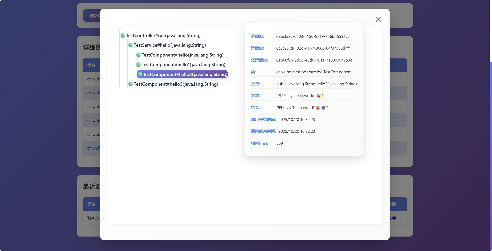
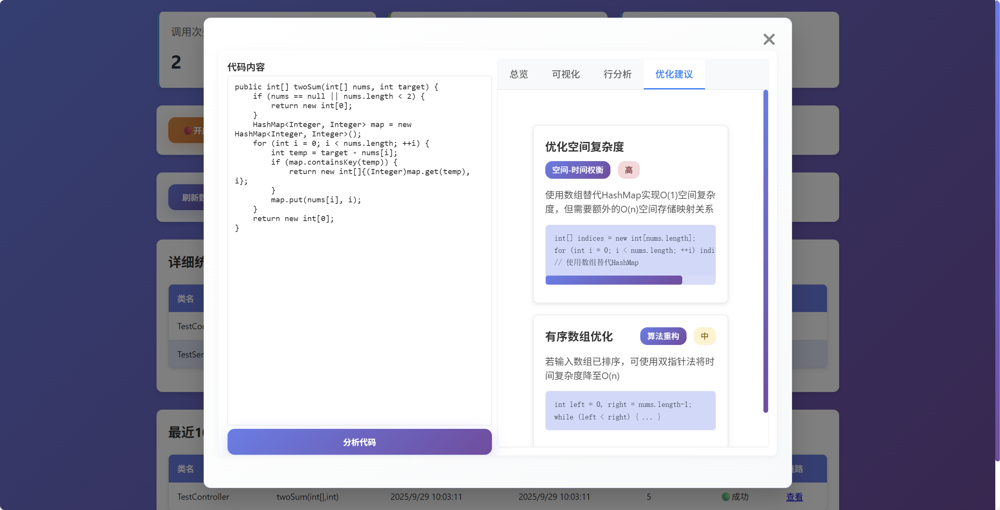

# Method Trace Log - 方法追踪日志

<div align="right">
  <a href="README.md">English</a> | 中文
</div>

>  一个用于方法追踪日志的starter组件，提供方法调用链路追踪、性能监控、日志文件管理和（可选的）AI时间复杂度分析等功能。

[](https://jitpack.io/#com.gitee.wb04307201/methodTraceLog)
[](https://gitee.com/wb04307201/methodTraceLog)
[](https://gitee.com/wb04307201/methodTraceLog)
[](https://github.com/wb04307201/methodTraceLog)
[](https://github.com/wb04307201/methodTraceLog)  
  

---


## 功能特性

### 方法追踪
- 自动记录方法调用链路
- 支持方法执行时间统计
- 可视化展示调用关系和耗时
- 支持异常捕获和记录

### 日志文件管理
- 实时查看日志文件内容
- 支持日志文件下载
- 日志内容搜索和过滤
- WebSocket实时日志推送

### AI代码分析（可选）
- 时间复杂度分析
- 性能优化建议
- 代码质量评估
- 可视化分析结果展示

---

## 引入

### 增加 JitPack 仓库
```xml
<repositories>
    <repository>
        <id>jitpack.io</id>
        <url>https://jitpack.io</url>
    </repository>
</repositories>
```

### Maven依赖
```xml
<dependency>
    <groupId>com.gitee.wb04307201.methodTraceLog</groupId>
    <artifactId>methodTraceLog-spring-boot-starter</artifactId>
    <version>1.0.14</version>
</dependency>
```

### 配置文件
添加配置:
```yaml
method-trace-log:
  log:
    enable: true          # 是否启用方法追踪，默认true
    serviceCalls:        # 启动时便开启的日志服务，默认无需配置全部开启，生产环境可以配置全部关闭，在需要时可通过web界面开启
      - name: SimpleLogService  # 日志输出服务
        enable: false
      - name: SimpleMonitorService  # 指标监控服务
        enable: false
  file:
    enable: true          # 是否启用文件相关功能，默认true
    path: ./logs          # 日志文件路径
    allowed-extensions:   # 允许访问的文件扩展名
      - .log
      - .txt
      - .out
    max-lines: 1000       # 单次查询最大行数
    max-file-size: 100    # 文件最大大小（MB）
    # 日志文件匹配模式, 
    # 默认(\d{4}-\d{2}-\d{2} \d{2}:\d{2}:\d{2}\.\d{3})\s+\[([^\]]+)\]\s+(\w+)\s+([^\s]+)\s*-\s*(.*)
    # 匹配%d{yyyy-MM-dd HH:mm:ss.SSS} [%thread] %-5level %logger{36} - %msg%n日志输出格式
    log-pattern: (\d{4}-\d{2}-\d{2} \d{2}:\d{2}:\d{2}\.\d{3})\s+\[([^\]]+)\]\s+(\w+)\s+([^\s]+)\s*-\s*(.*)
management:
  endpoints:
    web:
      exposure:
        include: methodtrace # 开启自定义端点
```

### AI分析配置（可选）

如果需要使用AI代码分析功能，需要引入和配置Spring AI，下面以通过ollama调用qwen3为例：
```xml
<dependencyManagement>
    <dependencies>
        <dependency>
            <groupId>org.springframework.ai</groupId>
            <artifactId>spring-ai-bom</artifactId>
            <version>1.0.2</version>
            <type>pom</type>
            <scope>import</scope>
        </dependency>
    </dependencies>
</dependencyManagement>
<dependencies>
    <dependency>
        <groupId>org.springframework.ai</groupId>
        <artifactId>spring-ai-starter-model-ollama</artifactId>
    </dependency>
</dependencies>
```

```yaml
spring:
  ai:
    ollama:
      chat:
        options:
          model: qwen3    # 使用的模型
      base-url: http://localhost:11434
```

## 使用

### 默认输出方的法日志：
```
2025-08-18T10:59:45.638+08:00  INFO 17236 --- [           main] c.w.m.t.l.s.impl.DefaultLogServiceImpl   : traceid: 734415a6-6059-42c9-95ee-399dd4877aab, pspanid: null, spanid: a52a7934-88d3-44e9-bcf5-1469a0364493, classname: cn.wubo.method.trace.log.TestController, methodSignature: public java.lang.String cn.wubo.method.trace.log.TestController.get(java.lang.String), context: [java], logActionEnum: LogActionEnum.BEFORE(desc=方法执行前), time: 1755485985638
2025-08-18T10:59:45.644+08:00  INFO 17236 --- [           main] c.w.m.t.l.s.impl.DefaultLogServiceImpl   : traceid: 734415a6-6059-42c9-95ee-399dd4877aab, pspanid: a52a7934-88d3-44e9-bcf5-1469a0364493, spanid: e9526f48-e423-4112-a9e2-8b3843c0d15a, classname: cn.wubo.method.trace.log.TestService, methodSignature: public java.lang.String cn.wubo.method.trace.log.TestService.hello(java.lang.String), context: [java], logActionEnum: LogActionEnum.BEFORE(desc=方法执行前), time: 1755485985644
2025-08-18T10:59:45.647+08:00  INFO 17236 --- [           main] c.w.m.t.l.s.impl.DefaultLogServiceImpl   : traceid: 734415a6-6059-42c9-95ee-399dd4877aab, pspanid: e9526f48-e423-4112-a9e2-8b3843c0d15a, spanid: 4c1ba448-612b-463a-8f75-a3eb6262e37f, classname: cn.wubo.method.trace.log.TestComponent, methodSignature: public java.lang.String cn.wubo.method.trace.log.TestComponent.hello(java.lang.String), context: [java], logActionEnum: LogActionEnum.BEFORE(desc=方法执行前), time: 1755485985647
2025-08-18T10:59:45.647+08:00  INFO 17236 --- [           main] c.w.m.t.l.s.impl.DefaultLogServiceImpl   : traceid: 734415a6-6059-42c9-95ee-399dd4877aab, pspanid: e9526f48-e423-4112-a9e2-8b3843c0d15a, spanid: 4c1ba448-612b-463a-8f75-a3eb6262e37f, classname: cn.wubo.method.trace.log.TestComponent, methodSignature: public java.lang.String cn.wubo.method.trace.log.TestComponent.hello(java.lang.String), context: JAVA say:'hello world!', logActionEnum: LogActionEnum.AFTER_RETURN(desc=方法执行后), time: 1755485985647
2025-08-18T10:59:45.648+08:00  INFO 17236 --- [           main] c.w.m.t.l.s.impl.DefaultLogServiceImpl   : traceid: 734415a6-6059-42c9-95ee-399dd4877aab, pspanid: a52a7934-88d3-44e9-bcf5-1469a0364493, spanid: e9526f48-e423-4112-a9e2-8b3843c0d15a, classname: cn.wubo.method.trace.log.TestService, methodSignature: public java.lang.String cn.wubo.method.trace.log.TestService.hello(java.lang.String), context: JAVA say:'hello world!', logActionEnum: LogActionEnum.AFTER_RETURN(desc=方法执行后), time: 1755485985648
2025-08-18T10:59:45.648+08:00  INFO 17236 --- [           main] c.w.m.t.l.s.impl.DefaultLogServiceImpl   : traceid: 734415a6-6059-42c9-95ee-399dd4877aab, pspanid: null, spanid: a52a7934-88d3-44e9-bcf5-1469a0364493, classname: cn.wubo.method.trace.log.TestController, methodSignature: public java.lang.String cn.wubo.method.trace.log.TestController.get(java.lang.String), context: JAVA say:'hello world!', logActionEnum: LogActionEnum.AFTER_RETURN(desc=方法执行后), time: 1755485985648
```

追踪id - traceid
跨度id - spanid
父跨度id - pspanid
通过traceid，spanid，pspanid可以追踪调用链


### 使用监控面板和Actuator集成
项目集成了Spring Boot Actuator，可以通过以下自定义端点查看监控信息：
```yaml
management:
  endpoints:
    web:
      exposure:
        include: methodtrace
```

**注意**：*配置开启methodtrace使用监控面板的全部功能*

通过URL访问内置方法调用监控面板: `http://localhost:8080/methodTraceLog/view`


如果配置了AI分析功能。则可以分析方法的时间复杂度以及优化建议





### 使用日志文件管理

通过URL访问日志文件查看器: `http://localhost:8080/methodTraceLog/logFile`


### 可以继承[AbstractCallService.java](methodTraceLog/src/main/java/cn/wubo/method/trace/log/AbstractCallService.java)接口并实现自定义日志数据据的处理

```java
@Slf4j
public class CustomLogServiceImpl extends AbstractCallService {

    public static final String LOG_TEMPLATE = "custom-log traceid: {}, pspanid: {}, spanid: {}, classname: {}, methodSignature: {}, context: {}, logActionEnum: {}, time: {}";

    @Override
    public void consumer(ServiceCallInfo serviceCallInfo) {
        if (serviceCallInfo.getLogActionEnum() == LogActionEnum.AFTER_THROW)
            log.error(LOG_TEMPLATE, serviceCallInfo.getTraceid(), serviceCallInfo.getPspanid(), serviceCallInfo.getSpanid(), serviceCallInfo.getClassName(), serviceCallInfo.getMethodSignature(), transContext(serviceCallInfo.getContext()), serviceCallInfo.getLogActionEnum(), serviceCallInfo.getTimeMillis());
        else
            log.info(LOG_TEMPLATE, serviceCallInfo.getTraceid(), serviceCallInfo.getPspanid(), serviceCallInfo.getSpanid(), serviceCallInfo.getClassName(), serviceCallInfo.getMethodSignature(), transContext(serviceCallInfo.getContext()), serviceCallInfo.getLogActionEnum(), serviceCallInfo.getTimeMillis());
    }

    @Override
    public String getCallServiceName() {
        return "CustomLog";
    }

    @Override
    public String getCallServiceDesc() {
        return "自定义日志";
    }
}
```


